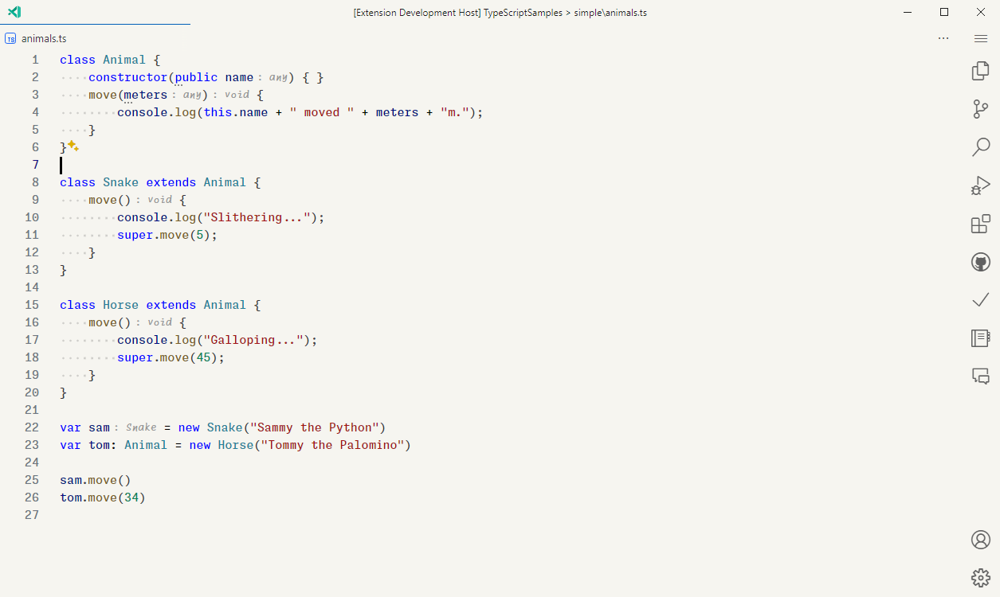
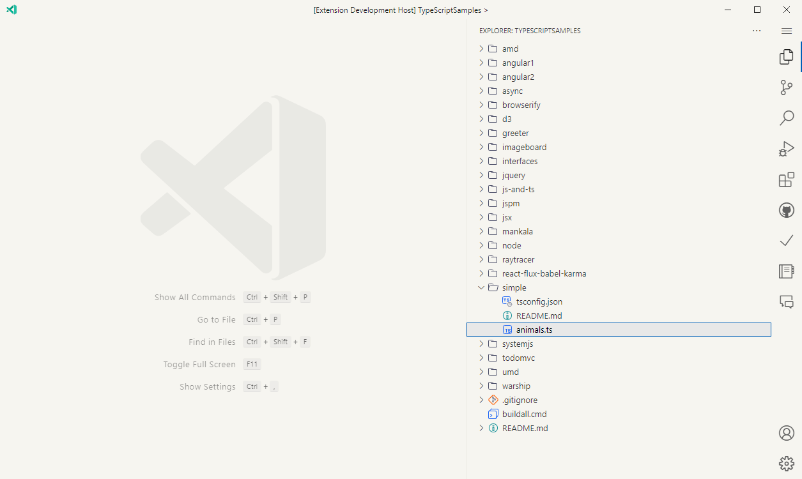
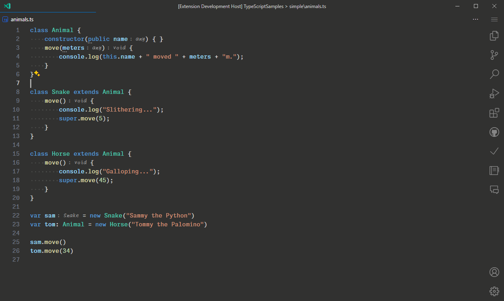

# Minimal Mist

Experience a breath of fresh air with Minimal Mist, a VSCode theme designed for those who appreciate simplicity and elegance.

[Visual Studio Code Marketplace](https://marketplace.visualstudio.com/items?itemName=mubaidr.minimal-mist)

## Features

- Subtle Background: Enjoy the soft and soothing background color #f6f5f0, reducing eye strain and creating a calm coding environment.
- Shadow-Free Design: With shadows disabled, the interface feels lighter and less cluttered.
- Streamlined Borders: Borders have been simplified, minimized, or removed, providing a clean and focused workspace.
- Clean Look: A refined, distraction-free interface that lets you focus on what matters most - your code.

### Dark Theme

For those who prefer a darker interface, Minimal Mist now offers a dark theme option. Experience the same minimalist design with a new dark twist:

- Calm Dark Background: A darker shade #3c3b36 to provide a soothing environment for night-time coding sessions.
- Enhanced Contrast: Text and code elements are clearly visible, reducing eye strain while maintaining the theme's elegant simplicity.
- Unified Design: The dark theme maintains the streamlined, shadow-free design and simplified borders for a cohesive look.

Embrace the elegance of simplicity with Minimal Mist. Perfect for developers who value a clean, minimalist aesthetic.

## Preview

### Light Variant

### Typescript



### File Explorer View



### Dark Variant

### Typescript



### File Explorer View


## Optional (Settings for Minimal Workspace)

You can also use following settings (my current setup) to reduce clutter and make your workspace even more minimal, without scrificing any functionality. Add these settings to your `settings.json` file in VSCode to achieve the same look as in the screenshots above:

```jsonc
"editor.renderLineHighlight": "none",
"editor.scrollbar.vertical": "hidden",
"window.commandCenter": false,
"window.menuBarVisibility": "compact",
"window.titleBarStyle": "custom",
"workbench.editor.tabActionCloseVisibility": false,
"workbench.editor.tabSizing": "fixed",
"workbench.editor.tabSizingFixedMaxWidth": 240,
"workbench.editor.tabSizingFixedMinWidth": 180,
"workbench.sideBar.location": "right",
"workbench.statusBar.visible": false,
"workbench.tree.indent": 22,
"workbench.tree.renderIndentGuides": "none",
```
